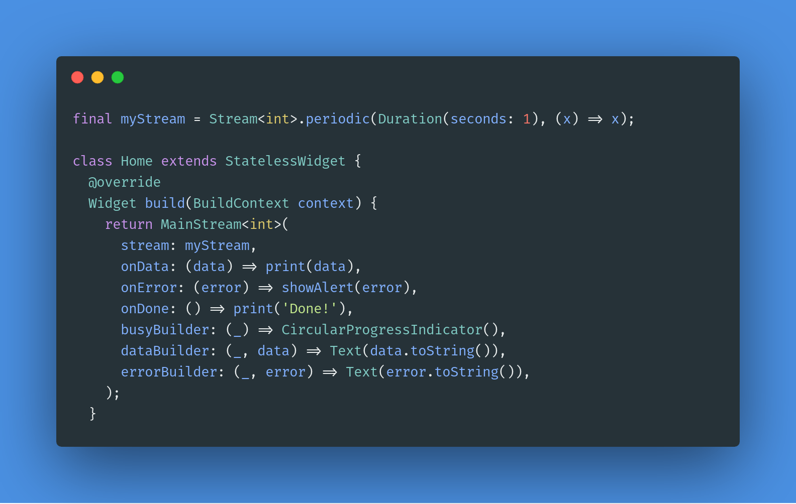

# mainstream

A `StreamBuilder` alternative that provides builder and event callbacks.



## Problem

`StreamBuilder` is one of the most powerful widgets in Flutter. Like `AnimatedBuilder` and `ValueListenableBuilder`, it can be used to selectively rebuild only parts of a widget, which is very efficient.

However `StreamBuilder` does not provide a way to receive callbacks for a Stream's `data`/`error`/`done` events. Often we may want to respond to those events by performing an action. For example, to pop all routes off a `Navigator` after a user logs in or out using `FirebaseAuth`. To do this with a StreamBuilder would require an additional stream listener. However this requires the boilerplate of creating a `StatefulWidget` and canceling our subscription. If our stream is not a broadcast stream (meaning it supports multiple listeners), we would have to avoid using a `StreamBuilder` altogether.

```
class Home extends StatefulWidget {
  @override
  _HomeState createState() => _HomeState();
}

class _HomeState extends State<Home> {
  StreamSubscription<FirebaseUser> _subscription;

  @override
  void initState() {
    super.initState();
    _subscription = FirebaseAuth.instance.onAuthStateChanged.listen((event) {
      Navigator.of(context).popUntil((route) => route.isFirst);
    });
  }

  @override
  void dispose() {
    _subscription.cancel();
    super.dispose();
  }

  @override
  Widget build(BuildContext context) {
    return StreamBuilder<FirebaseUser>(
      stream: FirebaseAuth.instance.onAuthStateChanged,
      builder: (_context, snapshot) => snapshot.data.isAnonymous ? LoggedOut() : LoggedIn(),
    );
  }
}
```

## Solution

The `Mainstream` widget uses the underlying `StreamBuilderBase` used by `StreamBuilder` to expose additional `onData`/`onError`/`onDone` callbacks. It also uses builder callbacks to provide mutually exclusive `busy/data/error` widget states.

```
class Home extends StatelessWidget {
  @override
  Widget build(BuildContext context) {
    return MainStream<FirebaseUser>(
      stream: FirebaseAuth.instance.onAuthStateChanged,
      onData: (_) => Navigator.of(context).popUntil((r) => r.isFirst),
      dataBuilder: (_, data) => data.isAnonymous ? LoggedOut() : LoggedIn(),
    );
  }
}
```

* Can be used in a `StatelessWidget`
* Works with single-subscription streams
* Provides generic type safety for the `data` provided to callbacks. The type parameter `<T>` can be omitted if it can be inferred by the compiler.

## Usage

```
final myStream = Stream<int>.periodic(Duration(seconds: 1), (x) => x).take(5);

class Home extends StatelessWidget {
  @override
  Widget build(BuildContext context) {
    return MainStream<int>(
      stream: myStream,
      onData: (data) => print(data),
      onError: (error) => showDialog(...),
      onDone: () => print('Done!'),
      busyBuilder: (_) => CircularProgressIndicator(),
      dataBuilder: (_, data) => Text(data.toString()),
      errorBuilder: (_, error) => Text(error.toString()),
    );
  }
```
The `stream` parameter is required.

The optional `busyBuilder` displays a widget when the `Stream` is waiting for its first event. By default, it shows a centered `CircularProgressIndicator`.

The optional `dataBuilder` displays a widget when the Stream's last event it a succesful data payload. The resulting `T` value of the `Stream<T>` is provided as a parameter to the callback.

The optional `errorBuilder` displays a widget when the `Stream` last event is an error, typically an `Error` or `Exception`.

The optional `onData` callback can be used to handle a successful data event, such as displaying an alert dialog or performing navigation. This can be used in place of or together with the `dataBuilder`. This will **not** be retriggered as a result of a widget rebuild.

The optional `onError` callback can be used to handle an error event, such as displaying an alert dialog or sending to a logging provider. It can be used in place of or together with the `errorBuilder`. This will **not** be retriggered as a result of a widget rebuild.

The optional `onDone` callback can be used to handle a Stream's done event. This will **not** be retriggered as a result of a widget rebuild.